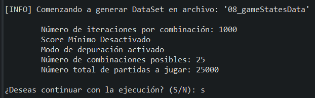
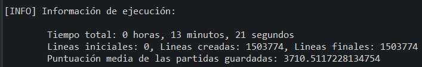

## Información sobre cada Dataset

#### 03_gameStatesData
##### (700k lineas) Generado con 10.000 ejecuciones del juego, score mínimo desactivado y estas dos clases
	- es.ucm.fdi.ici.c2324.practica1.grupo08.Ghosts
	- es.ucm.fdi.ici.c2223.practica1.grupo06.MsPacMan
	

 
 

##### 04_gameStatesData --> (700k lineas) Generado con 10.000 ejecuciones del juego, score mínimo activado en 3500 y estas dos clases
	- es.ucm.fdi.ici.c2324.practica1.grupo08.Ghosts
	- es.ucm.fdi.ici.c2223.practica1.grupo06.MsPacMan
	

 
 

#### 05_gameStatesData
##### (9M lineas) Generado con 125.000 ejecuciones del juego, score mínimo desactivado y estas implementaciones de años anteriores que consiguen muy buen score
	Pacmans:
	- es.ucm.fdi.ici.c2223.practica1.grupo06.MsPacMan (9958)
	- es.ucm.fdi.ici.c2122.practica1.grupo10.MsPacMan (7164)
	- es.ucm.fdi.ici.c2324.practica1.grupo07.MsPacMan (5378)
	- es.ucm.fdi.ici.c2223.practica2.grupo02.MsPacMan (7000) 
	- es.ucm.fdi.ici.c2122.practica2.grupo01.MsPacMan (6517)

	Ghosts:
	- es.ucm.fdi.ici.c2223.practica1.grupo06.Ghosts (2064)
	- es.ucm.fdi.ici.c2122.practica1.grupo01.Ghosts (2108)
	- es.ucm.fdi.ici.c2324.practica1.grupo08.Ghosts (2152)
	- es.ucm.fdi.ici.c2324.practica2.grupo04.Ghosts (1924)
	- es.ucm.fdi.ici.c2122.practica2.grupo01.Ghosts (2648)
	

 
 

#### 06_gameStatesData 05/03/25
##### (1.8M lineas) Generado con 25.000 ejecuciones del juego, score mínimo desactivado y estas implementaciones de años anteriores que consiguen muy buen score
	Pacmans:
	- es.ucm.fdi.ici.c2223.practica1.grupo06.MsPacMan (9958)
	- es.ucm.fdi.ici.c2122.practica1.grupo10.MsPacMan (7164)
	- es.ucm.fdi.ici.c2324.practica1.grupo07.MsPacMan (5378)
	- es.ucm.fdi.ici.c2223.practica2.grupo02.MsPacMan (7000) 
	- es.ucm.fdi.ici.c2122.practica2.grupo01.MsPacMan (6517)

	Ghosts:
	- es.ucm.fdi.ici.c2223.practica1.grupo06.Ghosts (2064)
	- es.ucm.fdi.ici.c2122.practica1.grupo01.Ghosts (2108)
	- es.ucm.fdi.ici.c2324.practica1.grupo08.Ghosts (2152)
	- es.ucm.fdi.ici.c2324.practica2.grupo04.Ghosts (1924)
	- es.ucm.fdi.ici.c2122.practica2.grupo01.Ghosts (2648)
	

	Estadísticas de las partidas jugadas para obtener el dataset
	- Media: 3745,18
	- Mediana: 2900,00
	- Desviación típica: 2986,08
	- Varianza: 8916694,39
	- Máximo: 17970,00
	- Mínimo: 0,00
	- Rango: 18080,00
	- Percentil 25: 1220,00
	- Percentil 75: 5540,00
	- Percentil 90: 8370,00
	- Asimetría (Skewness): 0,95
	- Curtosis (Kurtosis): 0,13

 
 

#### 07_gameStatesData 14/03/25
##### (5.4M lineas) Generado con 75.000 ejecuciones del juego, score mínimo desactivado y estas implementaciones de años anteriores que consiguen muy buen score
	Pacmans:
	- es.ucm.fdi.ici.c2223.practica1.grupo06.MsPacMan (9958)
	- es.ucm.fdi.ici.c2122.practica1.grupo10.MsPacMan (7164)
	- es.ucm.fdi.ici.c2324.practica1.grupo07.MsPacMan (5378)
	- es.ucm.fdi.ici.c2223.practica2.grupo02.MsPacMan (7000) 
	- es.ucm.fdi.ici.c2122.practica2.grupo01.MsPacMan (6517)

	Ghosts:
	- es.ucm.fdi.ici.c2223.practica1.grupo06.Ghosts (2064)
	- es.ucm.fdi.ici.c2122.practica1.grupo01.Ghosts (2108)
	- es.ucm.fdi.ici.c2324.practica1.grupo08.Ghosts (2152)
	- es.ucm.fdi.ici.c2324.practica2.grupo04.Ghosts (1924)
	- es.ucm.fdi.ici.c2122.practica2.grupo01.Ghosts (2648)
	

	Estadísticas de las partidas jugadas para obtener el dataset
	- Media: 3725,17
	- Mediana: 2910,00
	- Desviación típica: 2966,84
	- Varianza: 8802119,52
	- Máximo: 17750,00
	- Mínimo: 0,00
	- Rango: 17750,00
	- Percentil 25: 1230,00
	- Percentil 75: 5560,00
	- Percentil 90: 8330,00
	- Asimetría (Skewness): 0,94
	- Curtosis (Kurtosis): 0,11

 
 

#### 08_gameStatesData 19/03/25
##### (1.5M lineas) Generado con 25.000 ejecuciones del juego, score mínimo desactivado y estas implementaciones de años anteriores que consiguen muy buen score    SOLO SE GUARDAN ESTADOS CON MOVIMIENTOS VÁLIDOS

	Pacmans:
	- es.ucm.fdi.ici.c2223.practica1.grupo06.MsPacMan (9958)
	- es.ucm.fdi.ici.c2122.practica1.grupo10.MsPacMan (7164)
	- es.ucm.fdi.ici.c2324.practica1.grupo07.MsPacMan (5378)
	- es.ucm.fdi.ici.c2223.practica2.grupo02.MsPacMan (7000) 
	- es.ucm.fdi.ici.c2122.practica2.grupo01.MsPacMan (6517)

	Ghosts:
	- es.ucm.fdi.ici.c2223.practica1.grupo06.Ghosts (2064)
	- es.ucm.fdi.ici.c2122.practica1.grupo01.Ghosts (2108)
	- es.ucm.fdi.ici.c2324.practica1.grupo08.Ghosts (2152)
	- es.ucm.fdi.ici.c2324.practica2.grupo04.Ghosts (1924)
	- es.ucm.fdi.ici.c2122.practica2.grupo01.Ghosts (2648)
	

	Estadísticas de las partidas jugadas para obtener el dataset
	- Media: 3710,51
	- Mediana: 2880,00
	- Desviación típica: 2960,52
	- Varianza: 8764672,04
	- Máximo: 16490,00
	- Mínimo: 20,00
	- Rango: 16470,00
	- Percentil 25: 1210,00
	- Percentil 75: 5570,00
	- Percentil 90: 8270,00
	- Asimetría (Skewness): 0,93
	- Curtosis (Kurtosis): 0,05

	Movimientos inválidos en intersecciones 325469/1876569 - 17,34%
