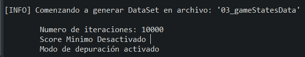
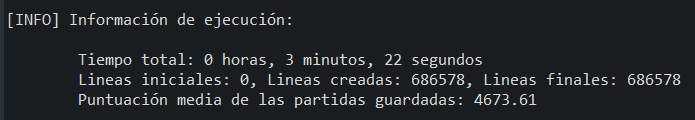
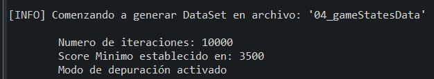
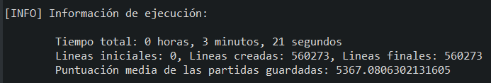

## Información sobre cada Dataset

##### 03_gameStatesData --> (700k lineas) Generado con 10.000 ejecuciones del juego, score mínimo desactivado y estas dos clases
	- es.ucm.fdi.ici.c2324.practica1.grupo08.Ghosts
	- es.ucm.fdi.ici.c2223.practica1.grupo06.MsPacMan
	

 
 

##### 04_gameStatesData --> (700k lineas) Generado con 10.000 ejecuciones del juego, score mínimo activado en 3500 y estas dos clases
	- es.ucm.fdi.ici.c2324.practica1.grupo08.Ghosts
	- es.ucm.fdi.ici.c2223.practica1.grupo06.MsPacMan
	

